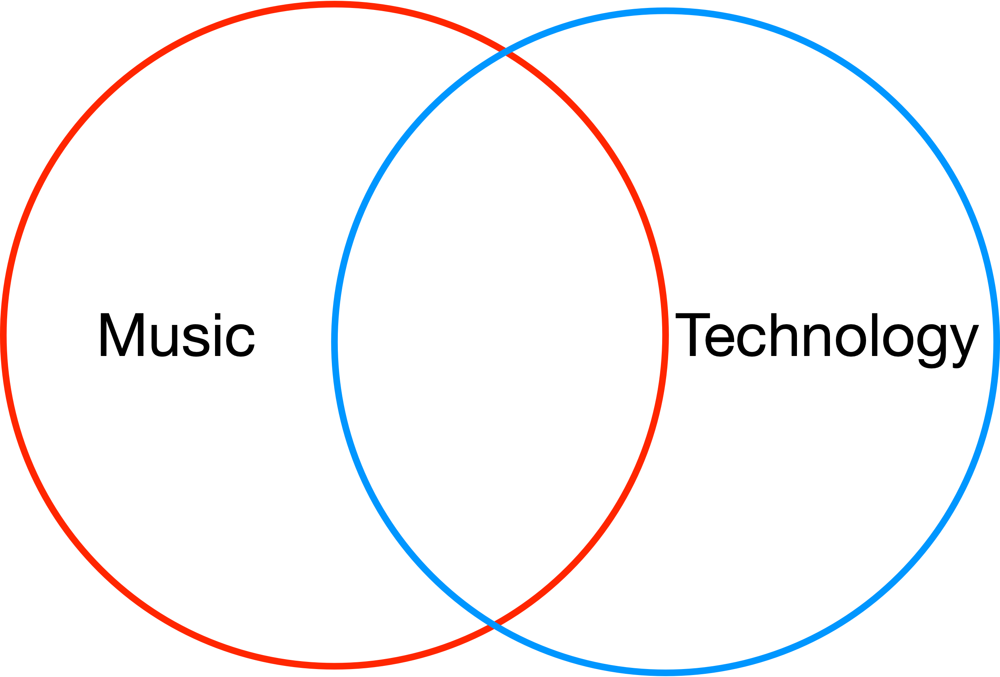
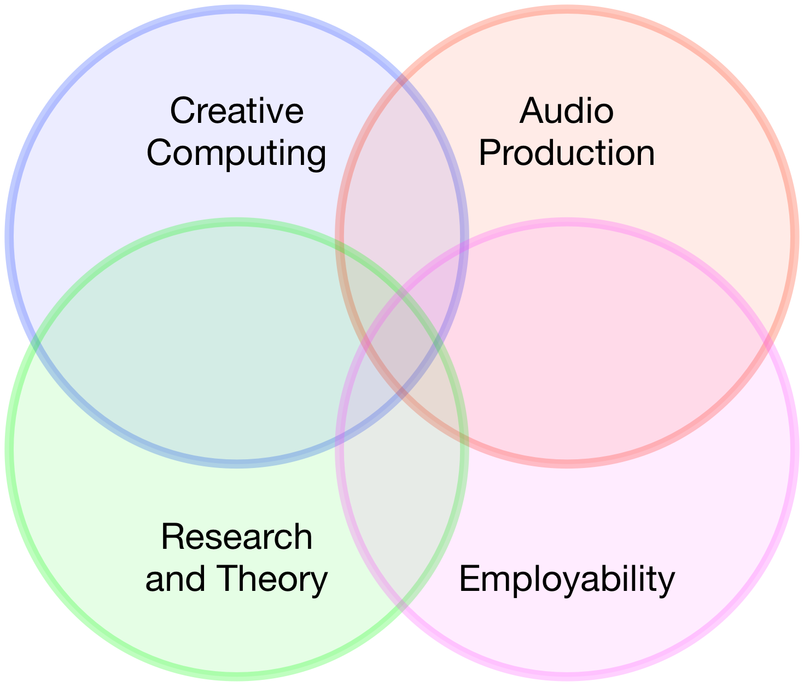
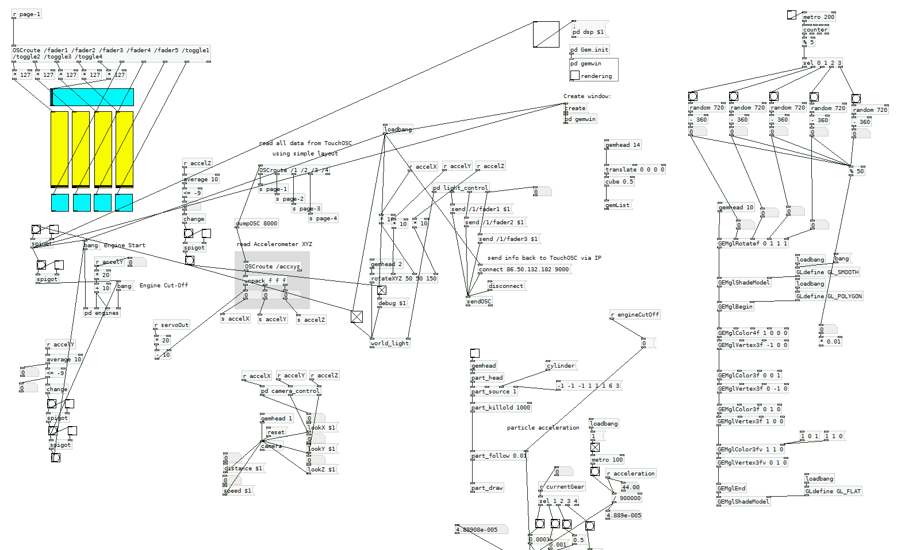
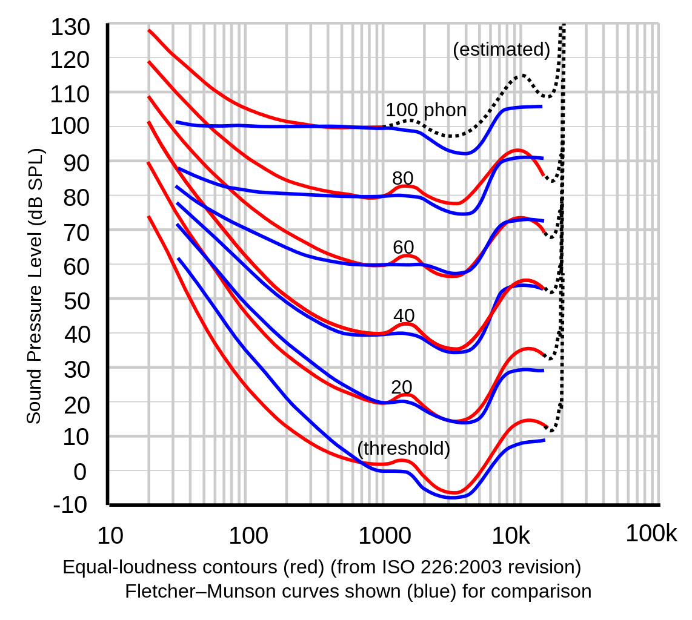
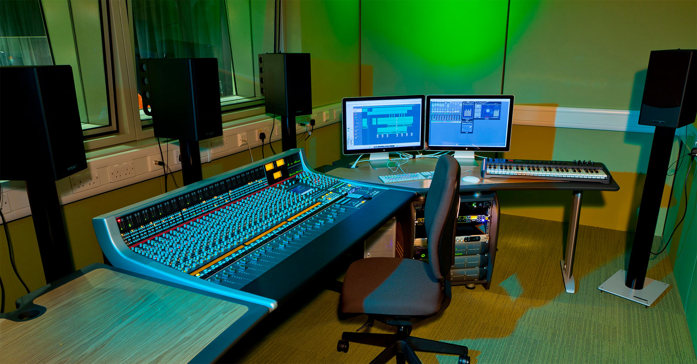
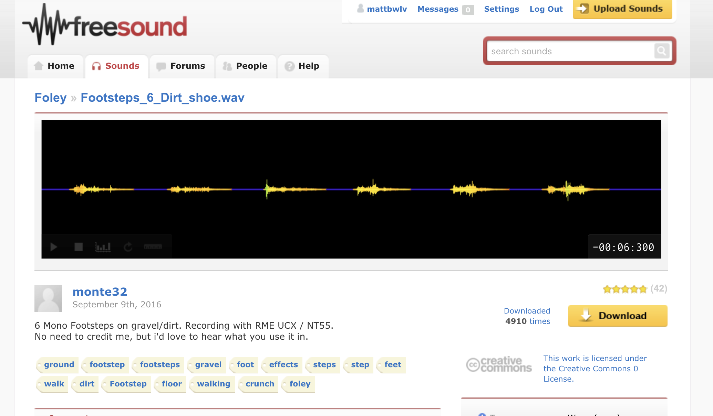
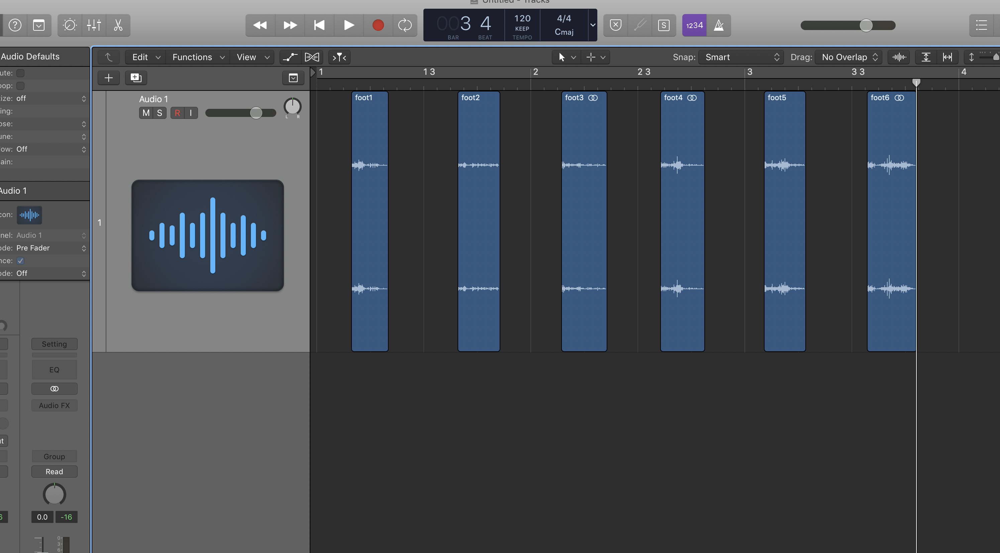
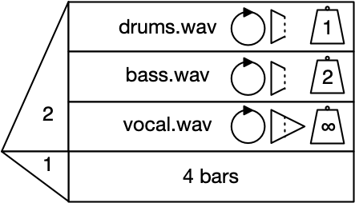

# Welcome to **Music Technology**

----

# [tinyurl.com/wlv2018](https://tinyurl.com/wlv2018)

---

### The topic for today - where are we?

----

---

# Audio Production

Audio engineering, mixdown, mastering, live sound, software use and development.

---

# Creative Computing

The use of DAWs such as Logic Pro and Pro Tools for audio production.
The use of audio programming languages such as SuperCollider and Pure Data for synthesis, video game sound and musical interface design.

*No programming experience necessary!*

---

# Research and Theory

Music, acoustic, and computer science theory.

Research techniques, academic writing.

---

# Employability

Work experience opportunities, networking and event organisation.

---

# Professional Engagement

Both courses have deep links with industry and a clear focus on employment.

The [University of Wolverhampton BA(Hons) Music Technology](http://www.jamesonline.org.uk/accreditation/wolverhampton/) course is accredited by [JAMES (Joint Audio Media Education Support)](http://www.jamesonline.org.uk/).

---

---

# Linear

---

---

---

---

# Nonlinear

---

---

---

---

---

> I use the term nonlinear to refer to the fact that games provide many choices for players to make, and that every gameplay will be different. Nonlinearity serves several functions in games by providing players with reasons to replay a game in a new order, thereby facing new challenges, for example, as well as to grant users a sense of agency and freedom.

-- Andy Farnell

---

# Game Sound

In many (but not all) cases, it is...

* Interactive
* Adaptive
* Dynamic
* Nonlinear

---

# Tools

---

# Text-oriented audio programming languages

Example -- note choice in SuperCollider

---

# Graphical audio programming languages

Example - footstep switching in Pure Data

---

----

---

## Adjacent uses of technology

---

# Algorithmic composition

---

---

# Algorithmic playback

---

# Intelligent Music Production

----

### How does this fit with the University of Wolverhampton?

---

---

Thanks!

Any questions or comments -- please send them to <matt.bellingham@wlv.ac.uk>